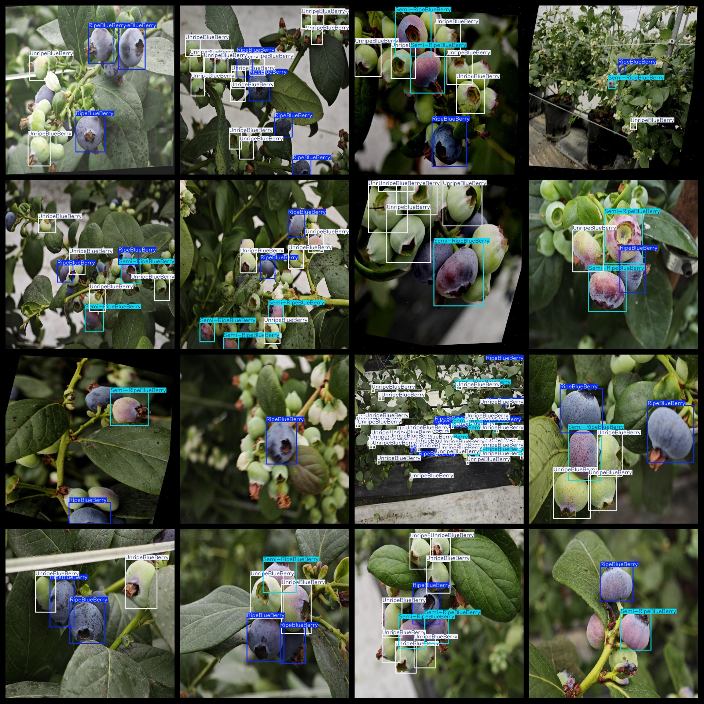

# Blueberry Ripeness Detection Dataset 1385 imagesVOC+YOLO format

The dataset of 1385 blueberry ripeness detection is in the form of VOC+YOLO.

Dataset format: Pascal VOC format + YOLO format (the txt file does not contain the split path, it only contains jpg images and corresponding VOC format xml files and yolo format txt files)

Number of image files: 1385

Number of XML Files: 1385

Number of txt files: 1385

Number of annotated categories: 3

The Github repository is: datasets_sl

['RipeBlueBerry', 'Semi-RipeBlueBerry', 'UnripeBlueBerry']

Number of boxes labeled in each category:

RipeBlueBerry frame count = 2800

Semi-RipeBlueBerry frame count = 1463

The number of frames in the unripe blueberry is 3402.

Total frames: 7665

Number of images per category:

RipeBlueBerry has 1162 images.

Semi-ripeBlueBerry has 911 images.

UnripeBlueBerry has 1029 images.

Image resolution: 640x640

Use the labeling tool: labelImg

Dataset Augmentation: Yes

Rules for annotation: Draw a rectangle around the category.

Important note: The dataset does not have been divided into training, validation, and testing sets.

Special Disclaimer: This dataset does not guarantee the accuracy of the trained models or weight files.

Annotation and image details are as follows:

## Images

---

Here is a pay link on Stripe (https://buy.stripe.com/3cs8yP7sY87d0vu9AB). Please contact me lonlonago@foxmail.com after funding $89, and I will send you a complete data files, thank you!

